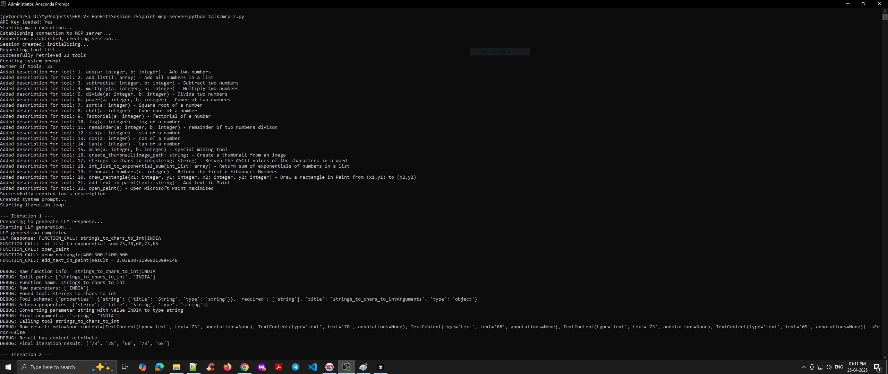
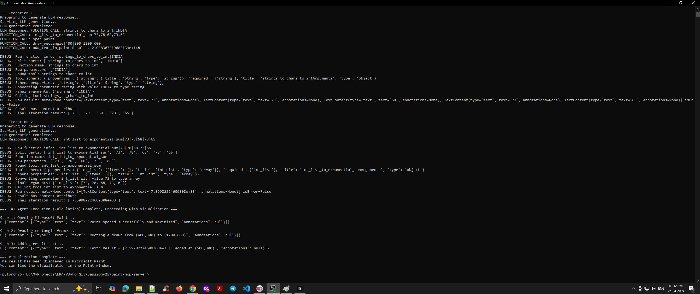

# Paint MCP Server

This project demonstrates an AI agent that performs calculations and visualizes results in Microsoft Paint using the Model-Code-Process (MCP) framework.

## Overview

The Paint MCP Server project consists of two main components:

1. **MCP Server (`example2.py`)**: Provides calculation tools and Paint automation capabilities
2. **AI Agent (`talk2mcp-2.py`)**: Communicates with the MCP server and uses Gemini LLM to process user queries

This system allows users to perform calculations and automatically visualize the results in Microsoft Paint through natural language queries.

> **Related Projects**: Check out the [Gmail MCP Server](README_GMAIL.md) for email automation capabilities.

## Features

- **Calculation Tools**: Addition, subtraction, multiplication, division, power, square root, factorial, and more
- **Data Processing**: Convert strings to ASCII values, calculate exponential sums of lists, generate Fibonacci sequences
- **Paint Automation**:
  - Open Microsoft Paint automatically
  - Draw rectangles with specified coordinates
  - Add text to Paint drawings
- **LLM Integration**: Uses Google's Gemini 1.5 Pro for natural language understanding

## Requirements

- Windows operating system (for Paint automation)
- Python 3.8+
- Google Gemini API key
- Required Python packages:
  - `mcp` (Model-Code-Process framework)
  - `google-generativeai`
  - `pywinauto`
  - `win32gui`, `win32con`, `win32com.client`, `win32api`, `win32process`
  - `psutil`
  - `python-dotenv`
  - `PIL` (Pillow)

## Setup

1. Clone this repository

2. Install required packages:
   ```
   pip install mcp google-generativeai pywinauto pywin32 psutil python-dotenv pillow
   ```

3. Create a `.env` file in the project root with your Gemini API key:
   ```
   GEMINI_API_KEY=your_api_key_here
   ```

4. Ensure you're using Windows with Microsoft Paint installed

## Usage

1. Start the AI agent:
   ```
   python talk2mcp-2.py
   ```

2. The agent will process the default query: "Find the ASCII values of characters in INDIA, calculate the sum of exponentials of those values, and visualize the result in Paint."

3. The agent will:
   - Calculate the ASCII values of "INDIA"
   - Calculate the sum of exponentials for these values
   - Open Microsoft Paint
   - Draw a rectangle
   - Add the result text to the Paint canvas

## How It Works

### MCP Server (`example2.py`)

The server defines tools that can be called by the AI agent:

1. **Calculation Tools**:
   - Basic operations: `add`, `subtract`, `multiply`, `divide`, etc.
   - Special functions: `strings_to_chars_to_int`, `int_list_to_exponential_sum`, etc.

2. **Paint Automation Tools**:
   - `open_paint`: Opens Microsoft Paint and maximizes the window
   - `draw_rectangle`: Draws a rectangle from coordinates (x1,y1) to (x2,y2)
   - `add_text_in_paint`: Adds text to the Paint canvas

### AI Agent (`talk2mcp-2.py`)

The agent communicates with the MCP server and manages the workflow:

1. Establishes a connection to the MCP server
2. Retrieves available tools from the server
3. Creates a system prompt with tool descriptions
4. Processes the user query using Google's Gemini LLM
5. Executes function calls based on the LLM's response
6. Handles the visualization workflow:
   - Opening Paint
   - Drawing a rectangle
   - Adding text with the result

## Screenshots

### Paint Automation Result

<p align="center"><i>Microsoft Paint MCP server logs 1 </i></p>


<p align="center"><i>Microsoft Paint MCP server logs 1 </i></p>

## Logs

The project creates log files in a `logs` directory with timestamps to help with debugging:
- `example2.py` creates logs with prefix `debug_`
- `talk2mcp-2.py` currently logs to the console

## Example Console Output

```
(pytorch25) D:\MyProjects\paint-mcp-server>python talk2mcp-2.py
API Key loaded: Yes
Starting main execution...
Establishing connection to MCP server...
Connection established, creating session...
Session created, initializing...
Requesting tool list...
Successfully retrieved 22 tools
Creating system prompt...
Number of tools: 22
Added description for tool: 1. add(a: integer, b: integer) - Add two numbers
Added description for tool: 2. add_list(l: array) - Add all numbers in a list
Added description for tool: 3. subtract(a: integer, b: integer) - Subtract two numbers
Added description for tool: 4. multiply(a: integer, b: integer) - Multiply two numbers
Added description for tool: 5. divide(a: integer, b: integer) - Divide two numbers
Added description for tool: 6. power(a: integer, b: integer) - Power of two numbers
Added description for tool: 7. sqrt(a: integer) - Square root of a number
Added description for tool: 8. cbrt(a: integer) - Cube root of a number
Added description for tool: 9. factorial(a: integer) - factorial of a number
Added description for tool: 10. log(a: integer) - log of a number
Added description for tool: 11. remainder(a: integer, b: integer) - remainder of two numbers divison
Added description for tool: 12. sin(a: integer) - sin of a number
Added description for tool: 13. cos(a: integer) - cos of a number
Added description for tool: 14. tan(a: integer) - tan of a number
Added description for tool: 15. mine(a: integer, b: integer) - special mining tool
Added description for tool: 16. create_thumbnail(image_path: string) - Create a thumbnail from an image
Added description for tool: 17. strings_to_chars_to_int(string: string) - Return the ASCII values of the characters in a word
Added description for tool: 18. int_list_to_exponential_sum(int_list: array) - Return sum of exponentials of numbers in a list
Added description for tool: 19. fibonacci_numbers(n: integer) - Return the first n Fibonacci Numbers
Added description for tool: 20. draw_rectangle(x1: integer, y1: integer, x2: integer, y2: integer) - Draw a rectangle in Paint from (x1,y1) to (x2,y2)
Added description for tool: 21. add_text_in_paint(text: string) - Add text in Paint
Added description for tool: 22. open_paint() - Open Microsoft Paint maximized
Successfully created tools description
Created system prompt...
Starting iteration loop...

--- Iteration 1 ---
Preparing to generate LLM response...
Starting LLM generation...
LLM generation completed
LLM Response: FUNCTION_CALL: strings_to_chars_to_int|INDIA
FUNCTION_CALL: int_list_to_exponential_sum|73|78|68|73|65
FUNCTION_CALL: open_paint
FUNCTION_CALL: draw_rectangle|400|300|1200|600
FUNCTION_CALL: add_text_in_paint|Result = 2.641083641761754e+185

DEBUG: Raw function info:  strings_to_chars_to_int|INDIA
DEBUG: Split parts: ['strings_to_chars_to_int', 'INDIA']
DEBUG: Function name: strings_to_chars_to_int
DEBUG: Raw parameters: ['INDIA']
DEBUG: Found tool: strings_to_chars_to_int
DEBUG: Tool schema: {'properties': {'string': {'title': 'String', 'type': 'string'}}, 'required': ['string'], 'title': 'strings_to_chars_to_intArguments', 'type': 'object'}
DEBUG: Schema properties: {'string': {'title': 'String', 'type': 'string'}}
DEBUG: Converting parameter string with value INDIA to type string
DEBUG: Final arguments: {'string': 'INDIA'}
DEBUG: Calling tool strings_to_chars_to_int
DEBUG: Raw result: meta=None content=[TextContent(type='text', text='73', annotations=None), TextContent(type='text', text='78', annotations=None), TextContent(type='text', text='68', annotations=None), TextContent(type='text', text='73', annotations=None), TextContent(type='text', text='65', annotations=None)] isError=False
DEBUG: Result has content attribute
DEBUG: Final iteration result: ['73', '78', '68', '73', '65']

--- Iteration 2 ---
Preparing to generate LLM response...
Starting LLM generation...
LLM generation completed
LLM Response: FUNCTION_CALL: int_list_to_exponential_sum|73|78|68|73|65

DEBUG: Raw function info:  int_list_to_exponential_sum|73|78|68|73|65
DEBUG: Split parts: ['int_list_to_exponential_sum', '73', '78', '68', '73', '65']
DEBUG: Function name: int_list_to_exponential_sum
DEBUG: Raw parameters: ['73', '78', '68', '73', '65']
DEBUG: Found tool: int_list_to_exponential_sum
DEBUG: Tool schema: {'properties': {'int_list': {'items': {}, 'title': 'Int List', 'type': 'array'}}, 'required': ['int_list'], 'title': 'int_list_to_exponential_sumArguments', 'type': 'object'}
DEBUG: Schema properties: {'int_list': {'items': {}, 'title': 'Int List', 'type': 'array'}}
DEBUG: Converting parameter int_list with value 73 to type array
DEBUG: Final arguments: {'int_list': [73, 78, 68, 73, 65]}
DEBUG: Calling tool int_list_to_exponential_sum
DEBUG: Raw result: meta=None content=[TextContent(type='text', text='7.59982224609308e+33', annotations=None)] isError=False
DEBUG: Result has content attribute
DEBUG: Final iteration result: ['7.59982224609308e+33']

===  AI Agent Execution (Calculation) Complete, Proceeding with Visualization ===

Step 1: Opening Microsoft Paint...
✓ {"content": [{"type": "text", "text": "Paint opened successfully and maximized", "annotations": null}]}

Step 2: Drawing rectangle frame...
✓ {"content": [{"type": "text", "text": "Rectangle drawn from (400,300) to (1200,600)", "annotations": null}]}

Step 3: Adding result text...
✓ {"content": [{"type": "text", "text": "Text:'Result = [7.59982224609308e+33]' added at (500,300)", "annotations": null}]}

=== Visualization Complete ===
The result has been displayed in Microsoft Paint.
You can find the visualization in the Paint window.
```

## Extending the Project

### Adding New Calculation Tools

To add a new calculation tool, add a new function to `example2.py` with the `@mcp.tool()` decorator:

```python
@mcp.tool()
def my_new_function(param1: int, param2: int) -> float:
    """Description of what the function does"""
    logger.info("CALLED: my_new_function(param1: int, param2: int) -> float:")
    return float(some_calculation(param1, param2))
```

### Adding New Paint Tools

To add new Paint automation capabilities, add a new async function with the `@mcp.tool()` decorator:

```python
@mcp.tool()
async def my_new_paint_tool(param1: int, param2: str) -> dict:
    """Description of what the tool does"""
    global paint_app
    try:
        # Implementation here
        return {
            "content": [TextContent(type="text", text="Success message")]
        }
    except Exception as e:
        logger.error(f"Error in my_new_paint_tool: {str(e)}")
        return {"content": [TextContent(type="text", text=f"Error message: {str(e)}")]}
```

## Troubleshooting

- **Paint Automation Issues**: Make sure Paint is installed and accessible. The automation relies on window coordinates which may vary depending on your system resolution and UI settings.
- **LLM Generation Timeouts**: If you experience timeouts with the Gemini API, try increasing the timeout value in the `generate_with_timeout` function.
- **API Key Issues**: Ensure your Gemini API key is valid and properly configured in the `.env` file.

## License

This project is provided as an example implementation of the MCP framework. 